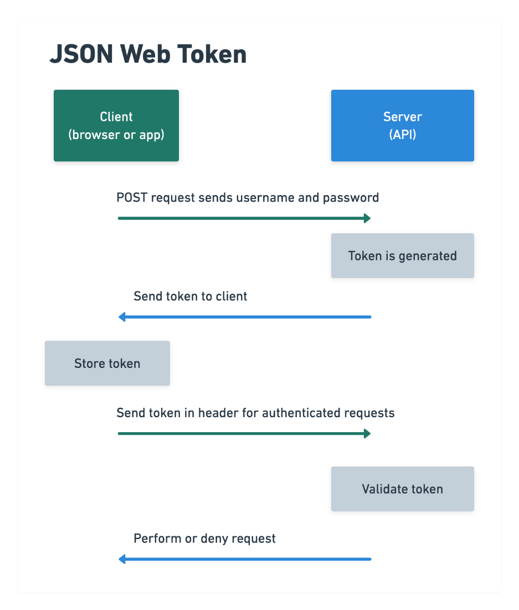

# Starting strapi

- To start strapi cd into the folder where strapi lives
- npm install
- npm run develop

# Logging a user into an application



- Not all servers allow you to fetch data without authentication.
- You authorize yourself by a username and password
- It is dangerous to send usernames and passwords up and down over the internet.
- The server creates a JWT token for you and this is used to authenticate you.
- The JWT token is encrypted and sent back and forth to the server.
- The server will asses the JWT and if it is valid, it will allow you to access the data.
- If it is not it will tell you not authorized.

## Strapi documentation

[Strapi Documentation](https://strapi.io/documentation/developer-docs/latest/getting-started/introduction.html)

### Logging a user into an application:

**Remember to create a user in strapi before you do this or else it will not work.**

[Making an authenticated request](https://strapi.io/documentation/developer-docs/latest/guides/auth-request.html#setup)

## Side note Axios get

```javascript
async function getUser() {
	try {
		const response = await axios.get('http://somewhere/character');
		console.log(response);
	} catch (error) {
		console.error(error);
	}
}
```

## Side note axios post

```javascript
async function sendUserData() {
	try {
		const response = await axios.post('/register', {
			email: this.register.email.trim(),
			password: this.register.password.trim(),
		});

		console.log(response);
	} catch (e) {
		console.log(e);
	}
}
```

# tasks for today

- Write UML to describe the login process to a project manager.
- Recreate a login like we have done today.
